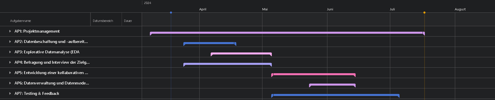

# DesignStudio_SS24
<br>

## Gantt Overview


## Roadmap
[Click here to see the roadmap.](https://git.sbg.ac.at/s1086122/designstudio_ss24/-/wikis/Roadmap)

### Survey
!! The Survey Submisson has ended !!
[Click here to see the Survey.](https://git.sbg.ac.at/s1086122/designstudio_ss24/-/wikis/Survey)<br>
Or scan the QR Code below: <br>
<br>

## Name
<strong>Health Hub Munich </strong> <br>
Data-Driven Insights for Public Health Action

## Description
Exploring health data in Munich for insights into public health trends, epidemiology, and healthcare provision. Collaborative platform for data-driven analysis and decision-making.

## Preview
```sh
git clone "https://github.com/getintogit1/HealthHubMunich.git"
cd HealthHubMunich
cd code
pip install -r requirements.txt
cd website_code
python manage.py runserver
```


## License
The license is temporary and can be changed as the project progresses.

## Project status
Progress: [██████████████████████]100%
