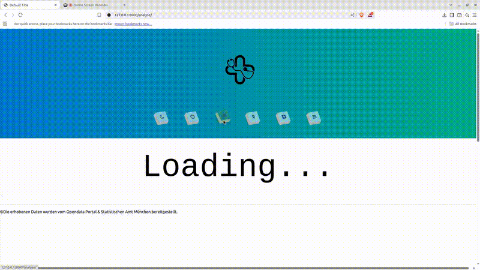
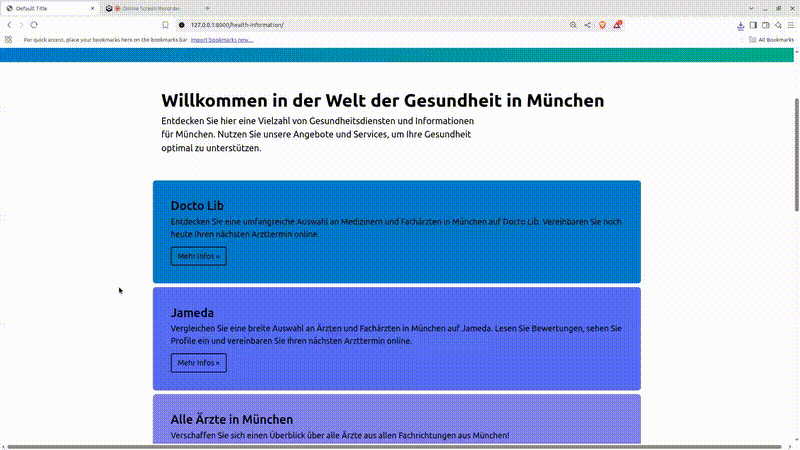

# A Healthcare Access & Density Visualization Web App

This Web App is a modern web application that visualizes the distribution and accessibility of healthcare facilities across Munich. It combines interactive maps, statistical data, and real-time analysis tools to inform citizens, researchers, and policymakers about healthcare density, proximity, and service gaps.

## Tech Stack
<p align="center">           </p>

## 🚀 Features

- 📍 **Interactive Map**: Displays pharmacies, hospitals, and doctors with district-wise filters.
- 📊 **Statistical Insights**: Visualizes population-to-facility ratios across time (2010–2022).
- 🏥 **Nearest Hospital Info**: Dynamically calculates and displays the nearest healthcare center.
- 🌗 **Map Themes**: Toggle between light, dark, and normal themes for better readability.
- 📅 **Time Slider**: Explore historical data over a timeline.
- 📈 **Data Analysis**: Integrated tools to analyze healthcare density trends in Munich.


- **Mapping**:
  - Leaflet.js / OpenStreetMap for geolocation
  - GeoJSON for district borders

## 📍 Example View

- OCM Orthopädische Chirurgie München marked with detailed location
- District-wise breakdown of pharmacies per resident
- Dark and light visualizations for user preferences

## Example Videos
<p align="center">
  <br/>
  <em>🏠 Homepage – animated overview</em>
</p>

<p align="center">
  <br/>
  <em>🗺️ Interactive Map – facility density & nearest hospital</em>
</p>

<p align="center">
  <br/>
  <em>📊 Analysis – time-slider & district statistics</em>
</p>

<p align="center">
  <br/>
  <em>📞 Contact – get in touch / feedback form</em>
</p>


## 📊 Data Sources

- Public health data from Stadt München
- GeoData for districts and healthcare facility coordinates
- Analysis based on year 2022 with comparison back to 2010
  
## Preview
```sh
git clone "https://github.com/getintogit1/Healthcare-Access-Platform.git"
cd HealthHubMunich
cd code
pip install -r requirements.txt
cd website_code
python manage.py runserver
```


## Project status
Progress: [██████████████████████]100%
